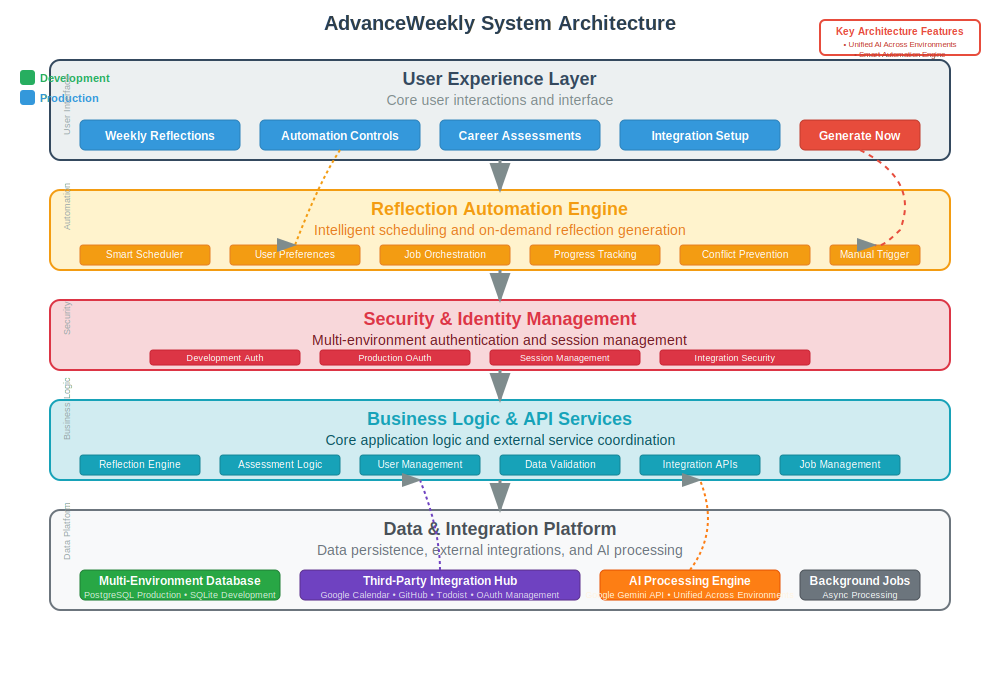

# AdvanceWeekly System Architecture

## Overview

AdvanceWeekly is a Next.js application that helps professionals track their Friday Reflections and generate AI-powered Career Check-Ins. The system combines manual reflection creation with automated data collection from third-party tools, processing everything through LLM analysis to provide meaningful career insights.

## Multi-Environment Architecture

### Environment Overview

AdvanceWeekly supports three distinct environments designed for different stages of development and deployment:

**Development Server**: Local development environment for active coding and testing
**Staging Environment**: Production-like environment for realistic testing with dev conveniences
**Production Environment**: Live application serving real users

### What is the Dev Server?

The **development server** runs locally on `http://localhost:3000` via `npm run dev`. It provides a complete working environment with simplified authentication and local data storage for rapid development.

### What is the Staging Environment?

The **staging environment** is accessible at `https://advanceweekly.io/staging` and combines production infrastructure with development conveniences:
- Uses production Cloud SQL database with isolated staging data
- Provides mock authentication for easy user switching
- Includes dev tools for data management and testing
- Uses mock integration data for consistent, predictable testing
- Full data reset capability for clean testing scenarios

### Environment Matrix: Development vs Staging vs Production

| Feature | Development Server | Staging Environment | Production |
|---------|-------------------|-------------------|------------|
| **URL** | `localhost:3000` | `advanceweekly.io/staging` | `advanceweekly.io` |
| **Database** | SQLite (dev.db) | Cloud SQL (staging schema) | Cloud SQL (production) |
| **Authentication** | Mock users (localStorage) | Mock users (database) | Google OAuth (NextAuth) |
| **Build** | Development (unoptimized) | Production (optimized) | Production (optimized) |
| **Infrastructure** | Local Node.js | Cloud Run | Cloud Run |
| **Integrations** | Mock data (constants) | Mock data (database) | Live OAuth connections |
| **LLM Processing** | Google Gemini API | Google Gemini API | Google Gemini API |
| **Session Storage** | JWT (local) | JWT (staging users) | Database sessions |
| **Dev Tools** | ✅ Available | ✅ Available | ❌ Hidden |
| **Data Reset** | File system | Database API | Not available |
| **User IDs** | `1`, `2`, `3` | `staging_1`, `staging_2`, `staging_3` | Real user IDs |

## System Architecture Diagram



The diagram illustrates the layered architecture with clear separation between:
- **User Interface Layer**: Landing page, Friday Reflections, Career Check-Ins, and integration management
- **Authentication Layer**: Environment-aware auth with NextAuth supporting both mock and Google OAuth
- **API Layer**: RESTful endpoints for all system operations including scheduled processing
- **Data Storage**: Dual database support (SQLite dev, PostgreSQL prod)
- **Integration Services**: Third-party connections to Google Calendar, Todoist, and GitHub
- **AI Processing**: Environment-aware LLM integration (local models for dev, OpenAI for production)
- **Scheduled Processing**: GCP-based batch jobs for weekly data collection and analysis

## Integration System Architecture

### Scheduled Data Collection Flow

The system implements a weekly batch processing pipeline that:

1. **Cloud Scheduler** triggers data collection every Monday at 9:00 AM
2. **Cloud Run Jobs** execute the data processing pipeline
3. **Integration Collectors** gather data from each user's connected services
4. **Data Aggregator** combines and processes the collected information
5. **LLM Processor** generates insights and recommendations using AI analysis
6. **Database Storage** persists both raw data and processed insights

## Core Components

### AuthenticatedApp.tsx (Main Application)

The central React component that orchestrates the entire user experience:

**Key Features:**
- **Tab-based Navigation**: Friday Reflections vs Career Check-Ins
- **Reflection Management**: CRUD operations with Markdown support
- **Career Check-In Generation**: AI-powered career assessment creation
- **Settings Integration**: User profile and integration management
- **Pagination**: Efficient handling of large reflection collections

**State Management:**
- useReducer for complex assessment operations
- useState for UI state and reflection data
- Custom hooks for authentication and data fetching

### Authentication System

**Environment-Aware Design:**
- **Development**: Mock authentication with localStorage persistence
- **Production**: Google OAuth with NextAuth and database sessions

**Session Management:**
- Development: JWT strategy with localStorage persistence
- Production: Database sessions with Prisma adapter

### Database Architecture

#### Multi-Environment Database Strategy

AdvanceWeekly uses different database configurations optimized for each environment:

| Environment | Database | Provider | Purpose | Schema Generation |
|-------------|----------|----------|---------|-------------------|
| **Testing (CI/CD)** | SQLite | `file:./test.db` | Fast, isolated unit/integration tests | `NODE_ENV=test` → SQLite schema |
| **Development** | PostgreSQL | Docker container | Production-like development | `NODE_ENV=development` → PostgreSQL schema |
| **Staging** | Cloud SQL | PostgreSQL | Production mirror with test data | `NODE_ENV=staging` → PostgreSQL schema |
| **Production** | Cloud SQL | PostgreSQL | Live user data | `NODE_ENV=production` → PostgreSQL schema |

#### Schema Generation System

The database schema is **dynamically generated** based on the environment to ensure compatibility:

```bash
# Schema template with placeholders
prisma/schema.template.prisma  # Contains __DB_PROVIDER__ and __METADATA_TYPE__

# Generated schema (DO NOT EDIT DIRECTLY)
prisma/schema.prisma           # Auto-generated based on environment

# Generation command
npm run generate-schema:force   # Regenerates based on NODE_ENV and DATABASE_URL
```

**Key Differences by Environment:**
- **SQLite (Testing)**: Uses `String` type for JSON fields due to SQLite limitations
- **PostgreSQL (All others)**: Uses native `Json` type for better performance and validation

#### Why Different Databases?

1. **Testing with SQLite**:
   - ✅ No external dependencies for CI/CD
   - ✅ Instant test database creation/teardown
   - ✅ Parallel test execution without conflicts
   - ✅ Consistent test environment across all platforms
   - ⚠️ Some PostgreSQL-specific features unavailable (but not needed for tests)

2. **Development/Production with PostgreSQL**:
   - ✅ Production parity for realistic development
   - ✅ Native JSON support with validation
   - ✅ Advanced query capabilities
   - ✅ Better performance for complex operations
   - ✅ Cloud SQL integration for managed infrastructure

#### Schema Management Best Practices

1. **Never manually edit `schema.prisma`** - Always use the template system
2. **Check environment before schema generation**:
   ```bash
   # For development/production (PostgreSQL)
   NODE_ENV=development npm run generate-schema:force
   
   # For testing (SQLite)
   DATABASE_URL="file:./test.db" NODE_ENV=test npm run generate-schema:force
   ```
3. **Migrations are PostgreSQL-only** - SQLite test databases are ephemeral
4. **JSON field handling**:
   - PostgreSQL: Store as native `Json` type
   - SQLite: Store as `String` with JSON serialization in application layer

### Database Schema

```sql
-- Core Models
User {
  id, name, email, image
  jobTitle, seniorityLevel
  performanceFeedback, careerLadderFile
  careerProgressionPlan, nextLevelExpectations  -- AI-generated career guidance
  companyCareerLadder                           -- Optional company context
  integrations[]
  snippets[]
  assessments[]
  asyncOperations[]
}

WeeklySnippet {
  id, userId, weekNumber, startDate, endDate
  content                    -- User-written content
  extractedTasks            -- JSON from integrations
  extractedMeetings         -- JSON from integrations
  aiSuggestions            -- AI-generated recommendations
}

Integration {
  id, userId, type          -- "google_calendar", "todoist", "github"
  accessToken, refreshToken -- Encrypted OAuth tokens
  expiresAt, isActive
  metadata                  -- JSON config per integration
  lastSyncAt
}

IntegrationData {
  id, userId, integrationType
  weekNumber, year, dataType -- "tasks", "meetings", "commits"
  rawData                   -- Original API response
  processedData            -- Cleaned/transformed data
}

PerformanceAssessment {
  id, userId, cycleName
  startDate, endDate
  generatedDraft           -- AI-generated self-assessment
}

AsyncOperation {
  id, userId, operationType  -- 'career_plan_generation', 'weekly_analysis', etc.
  status                     -- 'queued', 'processing', 'completed', 'failed'
  progress, inputData, resultData
  createdAt, startedAt, completedAt
  metadata                   -- Operation-specific data
}
```

### LLM Integration (llmproxy.ts)

**Environment-Aware AI Processing:**

**Development Environment:**
- **Local LLM**: Uses Ollama or similar local model for testing
- **Fast Iteration**: Quick responses without API costs
- **Offline Development**: Works without internet connection
- **Mock Responses**: Predictable outputs for testing

**Production Environment:**
- **OpenAI API Gateway**: Single point for all LLM requests
- **Request Management**: Rate limiting, retry logic, queuing
- **Response Processing**: Standardized output formatting
- **Cost Optimization**: Intelligent caching and token management

**Usage Patterns:**
```typescript
// Career Check-In generation
const assessmentDraft = await llmProxy.generateAssessment({
  snippets: userSnippets,
  feedback: userFeedback,
  careerLadder: careerLadderDoc
});

// Integration data analysis
const weeklyInsights = await llmProxy.analyzeWeeklyData({
  meetings: calendarData,
  tasks: todoistData,
  commits: githubData
});
```

### Integration Framework

**Base Integration Architecture:**
```typescript
abstract class BaseIntegration {
  abstract authenticate(): Promise<AuthResult>;
  abstract fetchWeeklyData(weekStart: Date): Promise<IntegrationData>;
  abstract refreshTokens(): Promise<void>;
}

class GoogleCalendarIntegration extends BaseIntegration {
  async fetchWeeklyData(weekStart: Date) {
    // Fetch meetings, events, calendar data
    // Transform to standard format
    // Store in integration_data table
  }
}

class TodoistIntegration extends BaseIntegration {
  async fetchWeeklyData(weekStart: Date) {
    // Fetch completed/pending tasks
    // Extract project and label information
    // Store in integration_data table
  }
}

class GitHubIntegration extends BaseIntegration {
  async fetchWeeklyData(weekStart: Date) {
    // Fetch commits, PRs, issues
    // Extract repository and contribution data
    // Store in integration_data table
  }
}
```

## GCP Production Deployment

### Infrastructure Components

**Cloud Run Services:**
- **Main Application**: Next.js app with auto-scaling (0-10 instances)
- **Scheduled Jobs**: Weekly data collection processors
- **Memory/CPU**: 1GB RAM, 1 CPU per instance

**Cloud SQL PostgreSQL:**
- **Instance**: db-f1-micro (cost-optimized for 50 users)
- **Storage**: 10GB SSD with auto-resize
- **Backups**: Daily automated backups at 3:00 AM
- **Maintenance**: Sunday 4:00 AM window

**Secret Manager:**
- **Database credentials**: Connection string with Unix socket format
- **OAuth secrets**: Google Client ID/Secret, NextAuth secret
- **API keys**: OpenAI API key, integration API keys
- **Encryption keys**: For token encryption/decryption

**Cloud Build Pipeline:**
```yaml
# Automated deployment on git push
1. Build multi-stage Docker image
2. Push to Artifact Registry
3. Deploy to Cloud Run with:
   - Database connection via Cloud SQL Proxy
   - Secrets injection via Secret Manager
   - Auto-scaling configuration
```

### Cost Structure (50 users)

**Monthly Estimates:**
- **Cloud Run**: $5-10 (request-based pricing)
- **Cloud SQL**: $7 (db-f1-micro instance)
- **Secret Manager**: $1 (secret access)
- **Storage**: $2 (database + images)
- **Cloud Build**: $2 (automated deployments)
- **Integration APIs**: Variable (Google/Todoist quotas)
- **Total**: ~$17-25/month

## Data Flow Architecture

### User Interaction Flow
1. **Authentication**: User signs in via Google OAuth (prod) or mock selection (dev)
2. **Dashboard Access**: Route to Friday Reflections or Career Check-Ins
3. **Reflection Management**: Create/edit Friday Reflections with Markdown support
4. **Integration Setup**: Connect third-party accounts via OAuth flows
5. **Automated Collection**: Background jobs gather integration data weekly
6. **AI Processing**: LLM analyzes collected data and generates insights
7. **Recommendation Display**: AI suggestions appear in reflection interface

### Weekly Processing Flow
1. **Trigger**: Cloud Scheduler initiates weekly data collection (Mondays 9 AM)
2. **User Iteration**: Process each user with active integrations
3. **Data Collection**: Parallel API calls to Google Calendar, Todoist, GitHub
4. **Data Storage**: Raw responses stored in integration_data table
5. **Data Processing**: Clean, transform, and aggregate collected data
6. **LLM Analysis**: Send aggregated data to OpenAI for insight generation
7. **Result Storage**: Update Friday Reflections with AI recommendations
8. **Error Handling**: Retry failed operations, log issues for investigation

## Security & Privacy

### Data Protection
- **Token Encryption**: All OAuth tokens encrypted before database storage
- **API Security**: Rate limiting and authentication on all endpoints
- **Data Retention**: Auto-delete integration data after 90 days
- **User Consent**: Clear permission flows for each integration

### GCP Security Features
- **IAM Roles**: Minimal service account permissions
- **VPC Integration**: Private database connections via Cloud SQL Proxy
- **Secret Management**: No hardcoded credentials, all via Secret Manager
- **HTTPS Enforcement**: TLS 1.2+ for all communications

## Staging Environment Implementation

### Path-Based Environment Detection

The staging environment uses Next.js middleware to detect requests to `/staging` and automatically configure the appropriate environment mode:

```typescript
// middleware.ts
export function middleware(request: NextRequest) {
  const isStaging = request.nextUrl.pathname.startsWith('/staging')
  const response = NextResponse.next()
  
  // Set environment context for downstream components
  response.headers.set('x-environment-mode', 
    isStaging ? 'staging' : 'production')
  
  // Rewrite /staging/path to /path for internal routing
  if (isStaging) {
    const internalPath = request.nextUrl.pathname.replace(/^\/staging/, '') || '/'
    url.pathname = internalPath
    return NextResponse.rewrite(url)
  }
  
  return response
}
```

### Environment-Aware Components

All components use environment detection utilities to adapt behavior:

```typescript
// lib/environment.ts
export function getEnvironmentMode(): 'development' | 'staging' | 'production'
export function shouldUseMockAuth(): boolean
export function shouldUseMockIntegrations(): boolean
export function shouldShowDevTools(): boolean
```

### Staging Data Management

**User Isolation**: Staging users have `staging_` ID prefixes to separate from production data
**Mock Integrations**: Same realistic mock data as dev, but stored in Cloud SQL database
**Dev Tools**: Full development panel available with staging-specific reset functionality
**Data Reset API**: `/api/staging/reset` endpoint for complete staging data reinitalization

### Deployment Integration

Single deployment serves both production and staging:
- Same Docker image and Cloud Run instance
- Runtime environment detection based on request path
- No additional infrastructure or deployment costs
- Staging data initialized automatically after deployment

## Reflection Automation System

AdvanceWeekly includes a comprehensive automated weekly reflection generation system that operates alongside manual reflection creation. This dual-mode approach provides users with both scheduled automation and on-demand generation flexibility.

### System Architecture

**Dual Generation Modes:**
- **Scheduled Automation**: Automatically generates reflections based on user preferences and timezone settings
- **Manual Generation**: On-demand reflection creation with immediate processing

**Core Components:**

```typescript
// Scheduling Layer
HourlyReflectionChecker {
  checkAndProcessUsers(): Promise<void>
  processUser(userId: string): Promise<void>
  shouldGenerateReflection(user: UserProfile): boolean
}

// Job Processing Layer
WeeklyReflectionHandler {
  process(jobData: ReflectionJobData): Promise<ReflectionResult>
  generateReflectionContent(userData: ConsolidatedData): Promise<string>
  storeReflection(content: string, metadata: ReflectionMetadata): Promise<Reflection>
}

// User Interface Layer
ManualReflectionGenerator {
  generateReflection(options?: GenerationOptions): Promise<OperationResult>
  trackProgress(operationId: string): Promise<ProgressStatus>
  handleConflicts(): Promise<ConflictResolution>
}
```

### Database Schema for Automation

**User Reflection Preferences:**
```sql
-- Added to User table
reflectionAutoGenerate         Boolean @default(true)
reflectionPreferredDay         String  @default("friday")      -- monday, friday, sunday
reflectionPreferredHour        Int     @default(14)            -- 0-23 (24-hour format)
reflectionTimezone            String  @default("America/New_York")
reflectionIncludeIntegrations Json    @default("[]")          -- ["google_calendar", "github"]
reflectionNotifyOnGeneration  Boolean @default(false)
```

**Async Operation Tracking:**
```sql
AsyncOperation {
  id            String   @id @default(cuid())
  userId        String
  operationType String   -- "weekly_reflection_generation"
  status        String   -- "queued", "processing", "completed", "failed"
  inputData     Json?    -- Generation parameters
  resultData    Json?    -- Generated reflection data
  progress      Int      @default(0)  -- 0-100 percentage
  progressMessage String?
  errorMessage  String?
  createdAt     DateTime @default(now())
  updatedAt     DateTime @updatedAt
}
```

### API Endpoints

**Manual Reflection Generation:**
```typescript
POST /api/reflections/generate
{
  triggerType: "manual" | "scheduled",
  weekStart?: Date,
  weekEnd?: Date,
  includeIntegrations?: string[],
  includePreviousContext?: boolean
}

Response: {
  success: boolean,
  operationId: string,
  weekNumber: number,
  year: number,
  estimatedDuration: number,
  message: string
}
```

**User Preference Management:**
```typescript
GET /api/user/reflection-preferences
Response: {
  preferences: ReflectionPreferences,
  availableIntegrations: string[]
}

PUT /api/user/reflection-preferences
{
  autoGenerate: boolean,
  preferredDay: "monday" | "friday" | "sunday",
  preferredHour: number, // 0-23
  timezone: string,
  includeIntegrations: string[],
  notifyOnGeneration: boolean
}
```

**Operation Status Tracking:**
```typescript
GET /api/jobs/weekly-reflection?operationId={id}
Response: {
  operationId: string,
  status: "queued" | "processing" | "completed" | "failed",
  progress: number,
  progressMessage?: string,
  error?: string,
  result?: ReflectionResult
}
```

### Scheduling Logic

**Hourly Checker Process:**
1. **User Query**: Find users with `reflectionAutoGenerate = true`
2. **Time Matching**: Check if current time matches user's preferred day/hour in their timezone
3. **Duplicate Prevention**: Verify no reflection exists for current week
4. **Conflict Detection**: Ensure no active generation operation exists
5. **Job Creation**: Create async operation and trigger reflection generation

**Timezone-Aware Scheduling:**
```typescript
// lib/schedulers/hourly-reflection-checker.ts
function shouldGenerateForUser(user: UserProfile): boolean {
  const userTime = DateTime.now().setZone(user.reflectionTimezone);
  const preferredDay = user.reflectionPreferredDay;
  const preferredHour = user.reflectionPreferredHour;
  
  // Check if current time matches user's preference
  const isCorrectDay = isPreferredDay(userTime, preferredDay);
  const isCorrectHour = userTime.hour === preferredHour;
  
  return isCorrectDay && isCorrectHour && user.reflectionAutoGenerate;
}
```

### Generation Process Flow

**Automated Generation Pipeline:**
1. **Data Collection**: Gather integration data for the target week
2. **Context Building**: Include previous reflections if enabled
3. **LLM Processing**: Generate reflection content using consolidated data
4. **Quality Validation**: Ensure content meets standards
5. **Storage**: Save reflection with automation metadata
6. **User Notification**: Optional notification on completion

**Manual Generation Pipeline:**
1. **Conflict Check**: Verify no existing reflection or active operation
2. **Parameter Validation**: Validate date ranges and integration selections
3. **Job Creation**: Create tracked async operation
4. **Background Processing**: Execute generation in job processor
5. **Progress Updates**: Real-time progress tracking for UI
6. **Result Delivery**: Return operation ID for status monitoring

### Error Handling and Recovery

**Operation Failure Recovery:**
```typescript
// Failed operations are marked with error details
// Users can retry manually after reviewing error
// System automatically cleans up failed operations after 24 hours
// No data corruption from failed automation attempts
```

**Duplicate Prevention:**
```typescript
// Multiple safety checks prevent duplicate reflections:
// 1. Database unique constraints on (userId, weekNumber, year)
// 2. Active operation detection before job creation
// 3. Existing reflection check in handler
// 4. Atomic operation creation with conflict detection
```

### User Experience Features

**Manual Generation Component:**
- Real-time progress indicators with estimated completion time
- Graceful error handling with actionable error messages
- Conflict detection with clear resolution options
- Success feedback with automatic data refresh

**Preference Management:**
- Intuitive timezone selection with validation
- Integration toggle with availability checking
- Immediate preference validation and feedback
- Stable UI layout preventing layout shifts

**Notification Options:**
- Optional email notifications on generation completion
- In-app status updates for manual generations
- Clear indication of automation vs manual generation source

## Technology Stack Summary

**Frontend Framework**: Next.js 14 with App Router
**Language**: TypeScript throughout
**Styling**: Tailwind CSS with custom design system
**Authentication**: NextAuth.js with Google OAuth (prod) / Mock users (dev/staging)
**Database**: PostgreSQL (prod/staging) / SQLite (dev) via Prisma ORM
**Cloud Platform**: Google Cloud Platform
**Container Runtime**: Cloud Run with Docker
**AI Integration**: Google Gemini API across all environments
**External APIs**: Google Calendar, Todoist, GitHub (prod) / Mock data (dev/staging)
**Reflection Automation**: Hourly scheduler, job processor, manual triggers
**Background Jobs**: Async operation tracking, progress updates, error recovery
**Infrastructure**: Terraform for GCP resource management
**CI/CD**: Cloud Build with automated deployments
**Monitoring**: Built-in GCP logging and metrics